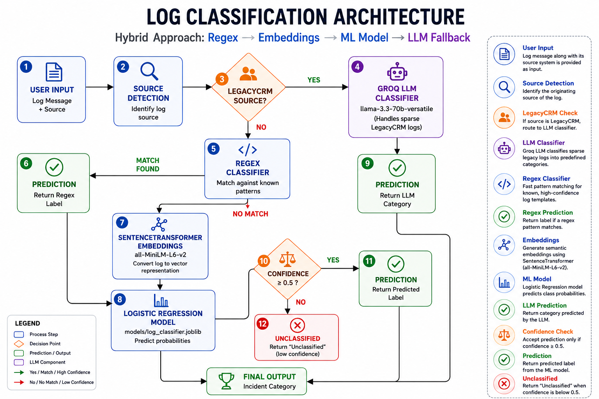

# 📋 Log Classification

<div align="center">

[](YOUR_APP_URL)


**Hybrid AI-Powered Log Classification System using Regex, Sentence Transformers, Machine Learning, and LLMs**

</div>

---

<a href="">Try the App</a>

## 🚀 Overview

Log Classification is a hybrid AI system that automatically categorizes operational logs into meaningful incident categories.

The system intelligently routes logs through the most appropriate classification mechanism:

* ⚡ **Regex Classifier** for high-confidence repetitive patterns
* 🧠 **Sentence Transformer Embeddings** for semantic understanding
* 📊 **Logistic Regression Model** for supervised classification
* 🤖 **Groq LLM** for sparse legacy-system categories

This architecture combines the speed of rule-based systems, the scalability of machine learning, and the flexibility of modern LLMs.

---

## 🎯 Problem Statement

Enterprise applications generate logs from multiple systems:

* CRM Platforms
* HR Systems
* Billing Applications
* Analytics Engines
* Third-Party APIs
* Legacy Software

These logs differ significantly in structure, vocabulary, and complexity.

Traditional rule-based approaches struggle with unseen logs, while purely supervised models often fail when classes have very limited training data.

This project solves the problem through a **Hybrid AI Pipeline**:

1. Known patterns → Regex
2. General logs → Embedding Model
3. Sparse Legacy Logs → LLM
4. Low-confidence predictions → Unclassified

---

## 🏗️ Architecture

### Architecture Diagram

<p align="center">
  
</p>

### Processing Flow

```text
User Input
     │
     ▼
Source Detection
     │
     ├──────────────► LegacyCRM?
     │                    │
     │ Yes                ▼
     │              Groq LLM
     │                    │
     │                    ▼
     │              Prediction
     │
     ▼ No
Regex Classifier
     │
     ├──── Match Found ───► Prediction
     │
     ▼ No Match
SentenceTransformer
(all-MiniLM-L6-v2)
     │
     ▼
Logistic Regression
     │
     ▼
Confidence ≥ 0.5 ?
     │
 ┌───┴────┐
 │        │
Yes       No
 │         │
 ▼         ▼
Prediction Unclassified
```

---

## ✨ Features

### 🔍 Single Log Classification

* Select source system
* Enter log message
* Get real-time prediction
* View classification route
* Confidence score display
* Prediction history

### 📂 Batch CSV Classification

Upload CSV files containing:

```csv
source,log_message
ModernCRM,...
ModernHR,...
LegacyCRM,...
```

Download enriched output:

```csv
source,log_message,target_label
ModernCRM,...,Security Alert
```

### 📊 Analytics Dashboard

* Category distribution
* KPI metrics
* Pie charts
* Bar charts
* Prediction summaries

### 🤖 Hybrid Routing

The system automatically selects the most suitable classifier:

| Source/Condition | Route           |
| ---------------- | --------------- |
| LegacyCRM        | LLM             |
| Regex Match      | Regex           |
| No Regex Match   | Embedding Model |
| Confidence < 0.5 | Unclassified    |

---

## 🖥️ Streamlit Dashboard

The project includes a fully interactive Streamlit application featuring:

* Modern dark theme
* Sidebar navigation
* Real-time inference
* CSV upload & download
* Analytics dashboard
* Architecture visualization
* Model documentation

Run:

```bash
streamlit run app.py
```

---

## 📂 Project Structure

```text
log-classification/
│
├── app.py
├── classify.py
├── processor_bert.py
├── processor_regex.py
├── processor_llm.py
├── server.py
│
├── models/
│   └── log_classifier.joblib
│
├── resources/
│   ├── architecture.png
│   ├── test.csv
│   └── output.csv
│
├── training/
│   ├── training.ipynb
│   └── dataset/
│       └── synthetic_logs.csv
│
├── requirements.txt
├── .env
└── README.md
```

---

## 🧠 Classification Pipeline

### 1️⃣ Regex Classifier

Used for deterministic, high-confidence patterns.

Supported Categories:

* User Action
* System Notification

Examples:

```text
Backup completed successfully.
```

```text
User User123 logged in.
```

---

### 2️⃣ Embedding Classifier

Model:

```python
SentenceTransformer("all-MiniLM-L6-v2")
```

Converts log messages into semantic vector embeddings.

---

### 3️⃣ Machine Learning Classifier

Model:

```python
LogisticRegression(max_iter=1000)
```

Predicts:

* HTTP Status
* Security Alert
* Error
* Critical Error
* Resource Usage

Low-confidence predictions:

```text
Unclassified
```

---

### 4️⃣ LLM Classifier

Model:

```text
llama-3.3-70b-versatile
```

Powered by Groq.

Used exclusively for:

* Workflow Error
* Deprecation Warning

Origin:

```text
LegacyCRM
```

---

## 📊 Dataset

Dataset:

```text
training/dataset/synthetic_logs.csv
```

### Dataset Statistics

| Metric         |  Value |
| -------------- | -----: |
| Total Rows     |  2,410 |
| Sources        |      6 |
| Labels         |      9 |
| Avg Log Length | 144.13 |
| Max Log Length |    385 |

### Class Distribution

| Category            | Count |
| ------------------- | ----: |
| HTTP Status         |  1017 |
| Security Alert      |   371 |
| System Notification |   356 |
| Resource Usage      |   177 |
| Error               |   177 |
| Critical Error      |   161 |
| User Action         |   144 |
| Workflow Error      |     4 |
| Deprecation Warning |     3 |

---

## 📈 Model Performance

Evaluation on embedding-classifier test set.

| Label          | Precision | Recall |   F1 |
| -------------- | --------: | -----: | ---: |
| Critical Error |      0.91 |   1.00 | 0.95 |
| Error          |      0.98 |   0.89 | 0.93 |
| HTTP Status    |      1.00 |   1.00 | 1.00 |
| Resource Usage |      1.00 |   1.00 | 1.00 |
| Security Alert |      1.00 |   0.99 | 1.00 |

### Overall Accuracy

```text
99%
```

---

## ⚙️ Installation

### Clone Repository

```bash
git clone https://github.com/snp-007/log-classification.git

cd log-classification
```

### Create Virtual Environment

```bash
python -m venv venv
```

### Activate Environment

#### Windows

```bash
venv\Scripts\activate
```

#### Linux / macOS

```bash
source venv/bin/activate
```

### Install Dependencies

```bash
pip install -r requirements.txt
```

### Create Environment Variables

Create:

```text
.env
```

Add:

```env
GROQ_API_KEY=your_groq_api_key_here
```

---

## 🚀 Usage

### Run Streamlit Dashboard

```bash
streamlit run app.py
```

### Run FastAPI Server

```bash
uvicorn server:app --reload
```

Open:

```text
http://127.0.0.1:8000/docs
```

---

## 💻 Python API Example

```python
from classify import classify

logs = [
    (
        "ModernCRM",
        "IP 192.168.133.114 blocked due to potential attack"
    ),
    (
        "LegacyCRM",
        "Case escalation for ticket ID 7324 failed because the assigned support agent is no longer active."
    )
]

labels = classify(logs)

print(labels)
```

Output:

```text
[
    'Security Alert',
    'Workflow Error'
]
```

---

## 🛠️ Technologies Used

### Backend

* Python
* FastAPI
* Uvicorn

### Machine Learning

* Scikit-Learn
* Sentence Transformers
* Logistic Regression

### LLM

* Groq
* Llama 3.3 70B Versatile

### Frontend

* Streamlit
* Plotly

### Data Processing

* Pandas
* Joblib

---

## 🔮 Future Improvements

* Docker containerization
* CI/CD pipeline
* Automated model retraining
* Explainable AI insights
* Multi-model confidence visualization
* Cloud deployment
* Real-time streaming logs
* Monitoring dashboard

---

## 👨‍💻 Author

**Siba Narayana Parida**

Pre-Final Year Undergraduate
National Institute of Technology Rourkela

Interests:

* Machine Learning
* Data Science
* NLP Systems
* AI Applications

---

## 📜 License

Licensed under the MIT License.
